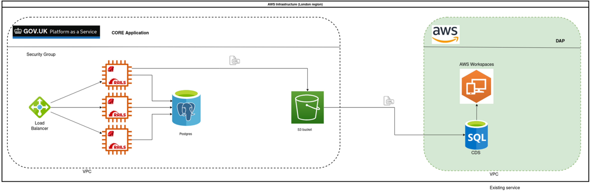

# Submit social housing lettings and sales data (CORE)

Ruby on Rails app that handles the submission of lettings and sales of social housing data in England. Currently in private beta.

## Domain documentation

- [Service overview](docs/service_overview.md)
- [Organisations](docs/organisations.md)
- [Users and roles](docs/users.md)
- [Supported housing schemes](docs/schemes.md)

## Technical Documentation

- [Developer setup](docs/developer_setup.md)
- [Frontend](docs/frontend.md)
- [Testing strategy](docs/testing.md)
- [Form Builder](docs/form_builder.md)
- [Form Runner](docs/form_runner.md)
- [Infrastructure](docs/infrastructure.md)
- [Monitoring](docs/monitoring.md)
- [Exporting to CDS](docs/exports)
- [Application decision records](docs/adr)

## API documentation

API documentation can be found here: <https://communitiesuk.github.io/submit-social-housing-lettings-and-sales-data>. This is driven by [OpenAPI docs](docs/api/DLUHC-CORE-Data.v1.json)

## System architecture

## User interface

