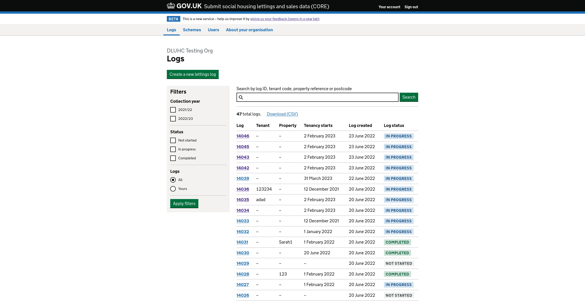

# Submit social housing lettings and sales data (CORE)

Ruby on Rails app that handles the submission of lettings and sales of social housing data in England. Currently in private beta.

## Technical Documentation

- [Developer setup](docs/developer_setup.md)
- [Form builder](docs/form_builder.md)
- [Form runner](docs/form_runner.md)
- [Infrastructure & CI/CD pipelines](docs/infrastructure.md)
- [Monitoring, logging & alerting](docs/monitoring.md)
- [Frontend](docs/frontend.md)
- [Testing strategies and style guide](docs/testing.md)

## API documentation

API documentation can be found here: <https://communitiesuk.github.io/mhclg-data-collection-beta>. This is driven by [OpenAPI docs](docs/api/DLUHC-CORE-Data.v1.json)

## Service

