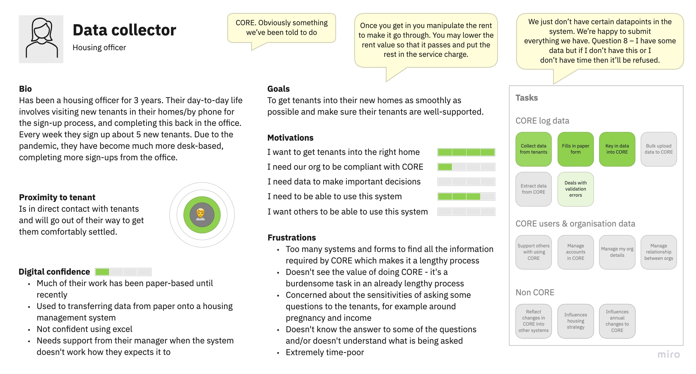
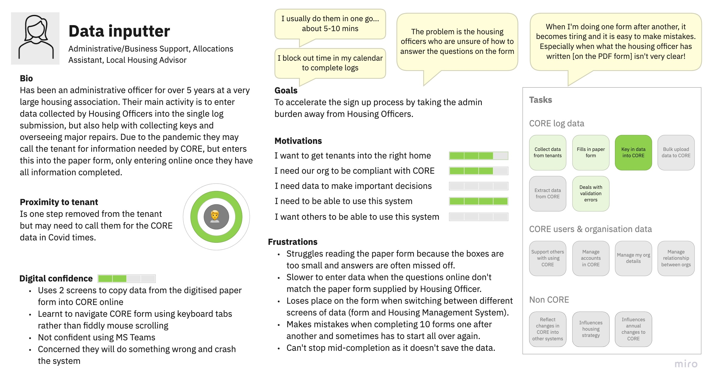
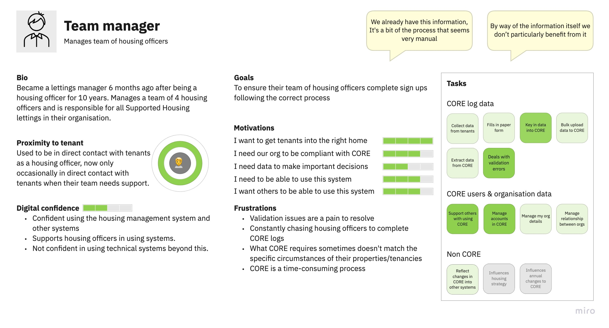
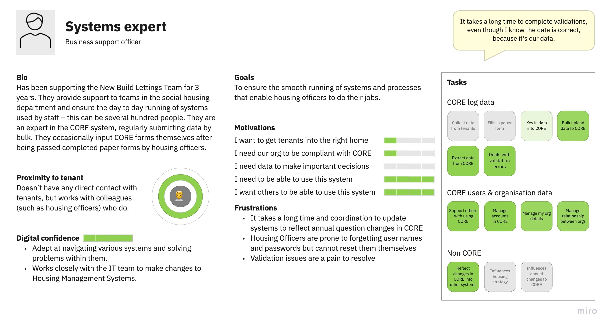
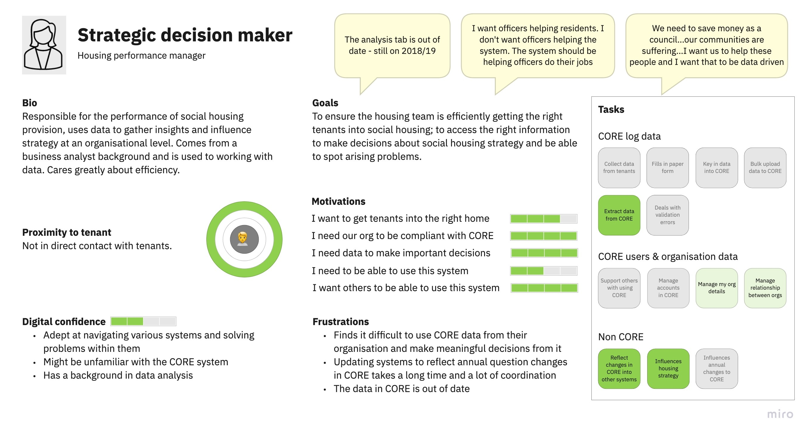
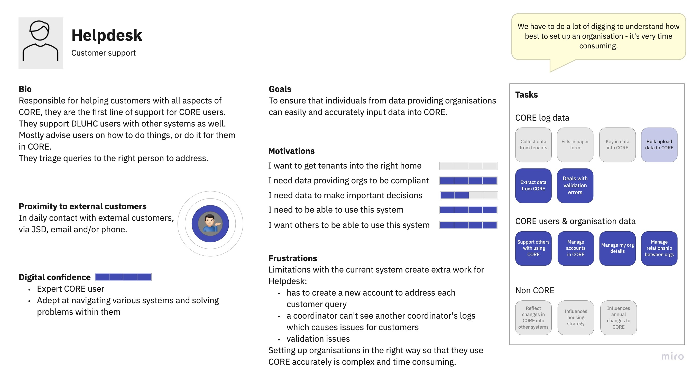
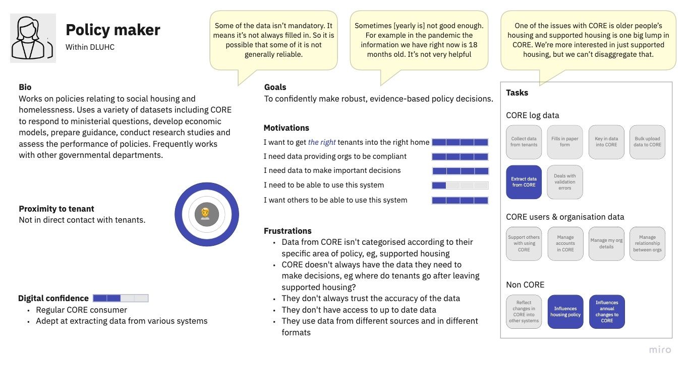
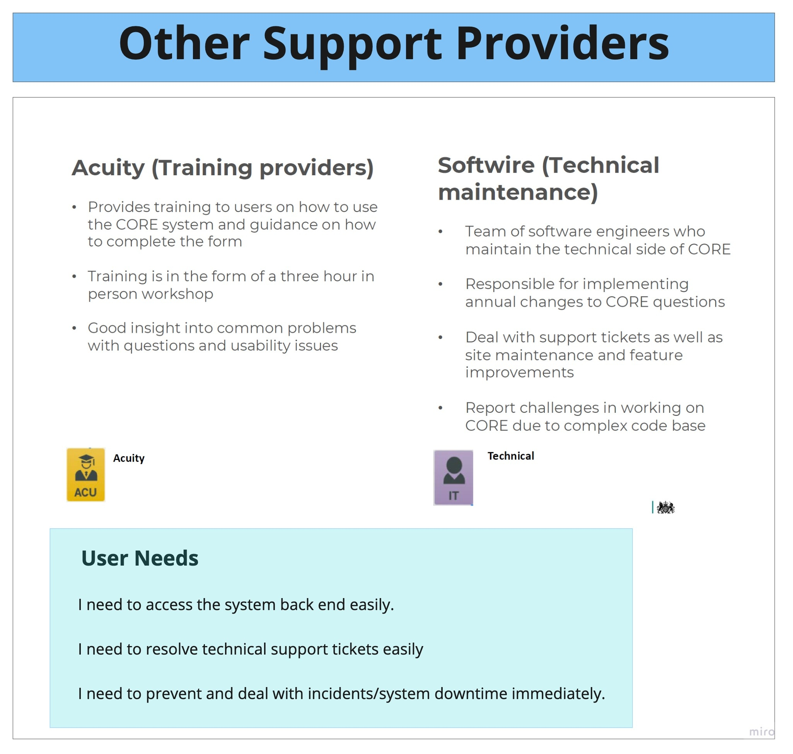
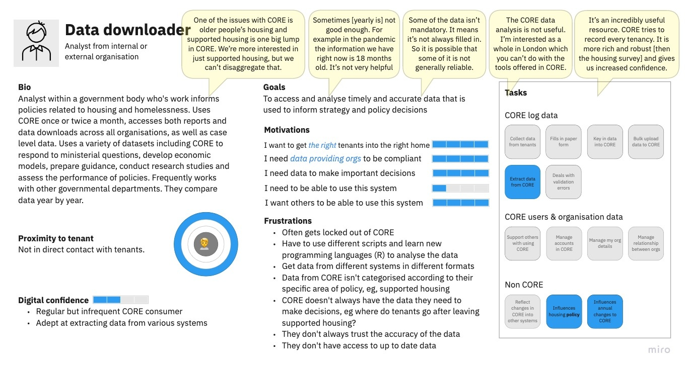

# User roles as modelled in the system

## External users

The primary users of the system are external data providing organisations: Local Authorities and Private Registered Providers (Housing Associations). These have 2 main user types:

- Data coordinators – administrators for their own organisation, can also complete logs
- Data providers – complete the logs

Additionally there are Data Protection Officers (DPO), which for some organisations is a separate role, but in our codebase is modelled as an attribute of the user (i.e. a data coordinator or provider can additionally be a DPO). They are responsible for ensuring the organisation has signed the data sharing agreement.

## Internal users

- Customer support (help desk) – can administrate all organisations
- ADD statisticians – primary consumers of the data collected via CDS/DAP

# Personas

These personas reflect the research carried out to date (November 2021) on real world users of the service.

## External personas from data providing organisations

Data collector:

Data inputter:

Team manager:

Systems expert:

Strategic decision maker:

## Internal Personas

Helpdesk:

Analyst/CORE team:

Policy maker:

Additional support providers (training and technical maintenance):

## External personas from governing body

Data downloader/analyst (external to DLUHC):

